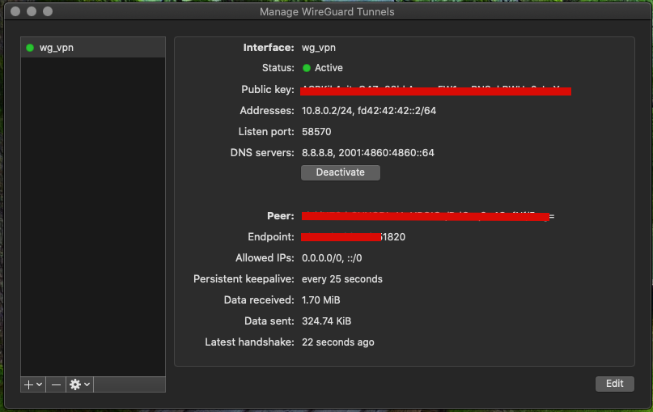

# Tutorial: Setup VPN on Digital Ocean

[REF: Digital Ocean CLI](https://github.com/digitalocean/doctl)
```
doctl -v compute ssh-key import terraform --public-key-file ~/.ssh/id_rsa.pub
doctl -v compute ssh-key list

doctl compute region list
doctl compute image list-distribution --public

>>53871280    19.10 x64            snapshot    Ubuntu           ubuntu-19-10-x64        true      20

doctl compute droplet list --format "ID,Name,PublicIPv4"
```

[REF: Digital Ocean provider](https://www.terraform.io/docs/providers/do/index.html)

## Setup VPN

1. Install package

    ```
    apt-get install wireguard
    ```

1. Generate wireguard keys

    ```
    wg genkey | tee server_private_key | wg pubkey > server_public_key

    wg genkey | tee client_private_key | wg pubkey > client_public_key
    ```

2. Configure server

    ```
    ➜ /etc/wireguard/wg0.conf 
    [Interface]
    Address = 10.8.0.1/24, fd42:42:42::1/64
    PostUp = iptables -A FORWARD -i %i -j ACCEPT; iptables -A FORWARD -o %i -j ACCEPT; iptables -t nat -A POSTROUTING -o eth0 -j MASQUERADE;ip6tables -A FORWARD -i wg0 -j ACCEPT; ip6tables -t nat -A POSTROUTING -o eth0 -j MASQUERADE
    PostDown = iptables -D FORWARD -i %i -j ACCEPT; iptables -D FORWARD -o %i -j ACCEPT; iptables -t nat -D POSTROUTING -o eth0 -j MASQUERADE;ip6tables -D FORWARD -i wg0 -j ACCEPT; ip6tables -t nat -D POSTROUTING -o eth0 -j MASQUERADE
    ListenPort = 51820
    PrivateKey = DEAik4njtpQ4$$EXAMPLE$kRWHp0yKEY=

    [Peer]
    PublicKey = EDEk4njtpQ4$$EXAMPLE$kRWHp0yKEY=
    AllowedIPs = 10.8.0.2/24, fd42:42:42::2/64
    ```

3. Configure Client  wg1.conf

    ```
    [Interface]
    PrivateKey = pkCLIENTpQ4$$EXAMPLE$kRWHp0yKEY=
    Address = 10.8.0.2/24, fd42:42:42::2/64
    DNS = 8.8.8.8, 2001:4860:4860::64

    [Peer]
    PublicKey = EDEk4njtpQ4$$EXAMPLE$kRWHp0yKEY=
    AllowedIPs = 0.0.0.0/0, ::/0
    Endpoint = 167.172.189.148:51820
    PersistentKeepalive = 25
    ```

4. Connecting from OSX


